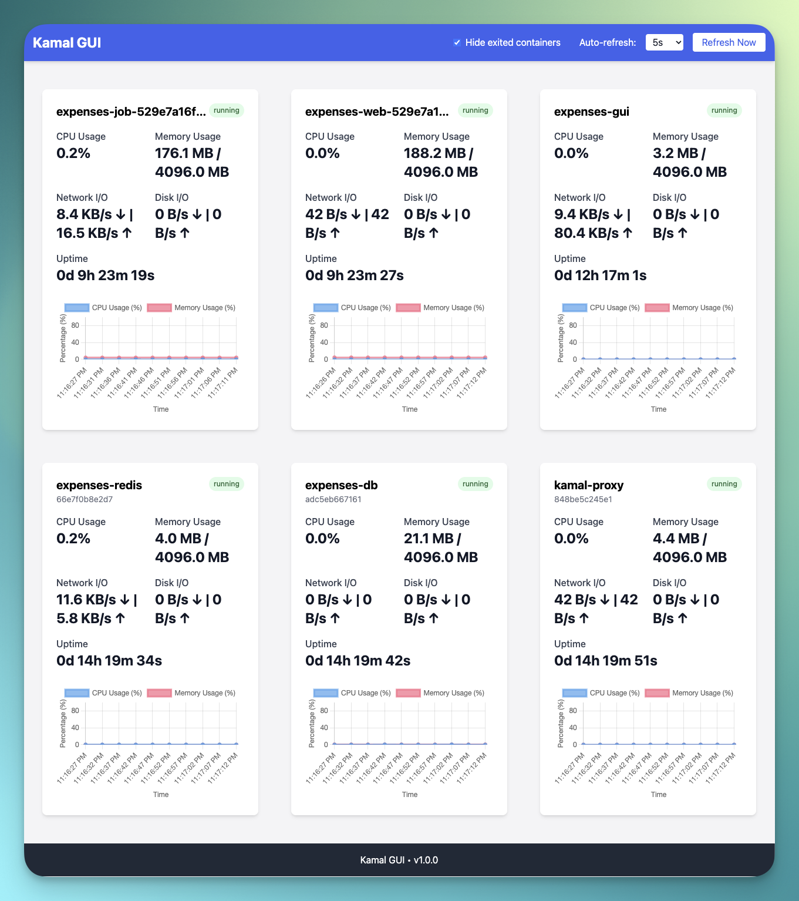

# Kamal GUI

A lightweight web GUI for monitoring Docker containers on your host machine. This application provides real-time monitoring of container metrics including CPU usage, memory usage, network I/O, disk I/O, and uptime.

## Features

- Responsive, modern UI built with Tailwind CSS
- Real-time monitoring with configurable refresh intervals
- Interactive charts for visualizing container performance
- No external dependencies (database, Redis, etc.) required
- Runs in a Docker container for easy deployment
- Basic authentication for secure access

## Screenshots


*Main dashboard showing container metrics and status*

## Installation

### Prerequisites

- Docker installed on your host machine
- Docker socket accessible

### Quick Start

Add an accessory to your `deploy.yml`:

```bash
accessories:
  gui:
    image: kobaltz/kamalgui:latest
    options:
      pull: always
    host: YOUR_HOST_IP
    port: 8080:80
    env:
      USERNAME: your_username
      PASSWORD: your_secure_password
    volumes:
      - /var/run/docker.sock:/var/run/docker.sock
```

Replace `YOUR_HOST_IP` with the IP address of your host machine.
Replace `your_username` and `your_secure_password` with your desired credentials for basic authentication.

> Note: If USERNAME and PASSWORD are not provided, authentication will be disabled.

Deploy with

```bash
kamal accessory reboot gui
```

Then open your browser and navigate to `http://YOUR_HOST_IP:8080`


## Security Considerations

This application needs access to the Docker socket which gives it full control over your Docker environment. In production environments, consider:

- Running the container with read-only access if possible
- Implementing proper authentication and HTTPS
- Running behind a reverse proxy if exposing to the internet

## License

MIT
